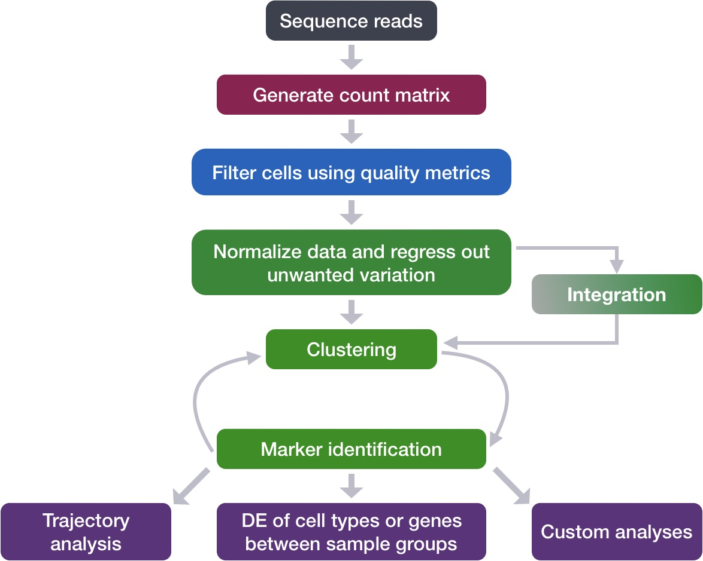
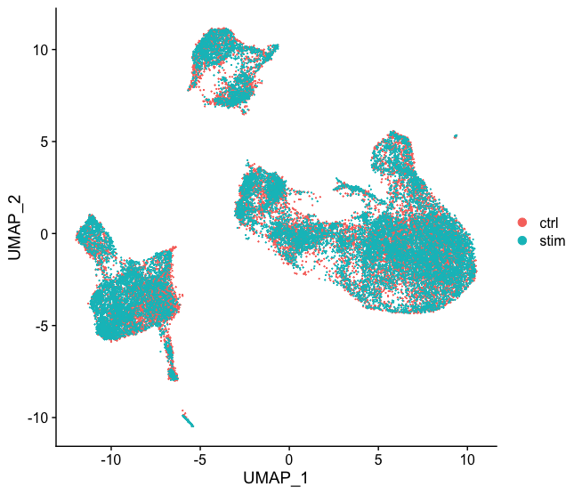
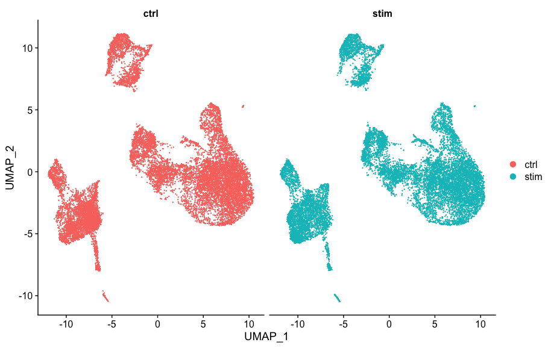

# Single-cell RNA-seq workflow for identifying cell types and cell states

_**By Mary Piper (Pfizer), including materials by the [Harvard Chan Bioinformatics Core](https://hbctraining.github.io/main/)**_

# Normalization

<p align="center">

</p>


_**Goals:**_ 
 
 - _To accurately **normalize the gene expression values** to account for differences in sequencing depth and overdispersed count values._
 - _To **identify the most variant genes** likely to be indicative of the different cell types present._

_**Challenges:**_
 
 - _**Checking and removing unwanted variation** so that we do not have cells clustering by artifacts downstream_

_**Recommendations:**_
 
 - _Have a good idea of your expectations for the **cell types to be present** prior to performing the clustering. Know whether you expect cell types of low complexity or higher mitochondrial content AND whether the cells are differentiating_
 - _**Regress out** number of UMIs (default using sctransform), mitochondrial content, and cell cycle, if needed and appropriate for experiment, so not to drive clustering downstream_
 
***

Within scRNA-seq data, the counts of mapped reads for each gene is proportional to the expression of RNA ("interesting") in addition to many other factors ("uninteresting"). Normalization is the process of adjusting raw count values to account for the "uninteresting" factors. 

From the Satija sctransform paper [[Hafemeister & Satija, 2019](https://genomebiology.biomedcentral.com/articles/10.1186/s13059-019-1874-1)], the qualities of an effectively normalized dataset were described:

1. _In general, the normalized expression level of a gene should not be correlated with the total sequencing depth of a cell. Downstream analytical tasks (dimensional reduction, differential expression) should also not be influenced by variation in sequencing depth._

<p align="center">

</p>

2. _The variance of a normalized gene (across cells) should primarily reflect biological heterogeneity, independent of gene abundance or sequencing depth. For example, genes with high variance after normalization should be differentially expressed across cell types, while housekeeping genes should exhibit low variance. Additionally, the variance of a gene should be similar when considering either deeply sequenced cells, or shallowly sequenced cells._

Many of the current methods for normalization rely on per cell size factors; however, these methods assume the **RNA content is constant for all cells in the dataset** and that a single scaling factor for all genes can be applied [[Hafemeister & Satija, 2019](https://genomebiology.biomedcentral.com/articles/10.1186/s13059-019-1874-1)]. A frequently observed feature of scRNA-seq data normalized using these methods is that the largest source of variation (PC1) in the dataset is the library size, indicating ineffective normalization. 

[Germain et. al. (2020)](https://genomebiology.biomedcentral.com/articles/10.1186/s13059-020-02136-7)
found sctransform to perform better than other methods for separating subpopulations and removing the effect of library size.

Sctransform creates a generalized linear model (GLM) for each gene with UMI counts as the response and sequencing depth as the explanatory variable. The Pearson residuals of the model are calculated and represent a variance-stabilization transformation, removing the dependence between a gene’s average expression and cell-to-cell variation [[Hafemeister & Satija, 2019](https://genomebiology.biomedcentral.com/articles/10.1186/s13059-019-1874-1)]. [Hafemeister & Satija, 2019](https://genomebiology.biomedcentral.com/articles/10.1186/s13059-019-1874-1) explain the benefits of sctransform as: 

1. _We do not assume a fixed “size,” or expected total molecular count, for any cell._

2. _Our regularization procedure explicitly learns and accounts for the well-established relationship between a gene’s mean abundance and variance in single-cell data_

3. _Our VST is data driven and does not involve heuristic steps, such as a log-transformation, pseudocount addition, or z-scoring._

4. _... Pearson residuals are independent of sequencing depth and can be used for variable gene selection, dimensional reduction, clustering, visualization, and differential expression._

The sctransform paper showed that the **same constant scaling factor cannot normalize different groups of genes**, by demonstrating the inability of scaling factors to effectively normalize high abundance genes. In addition, with log-normalized data, it was observed that **cells with low total UMI counts were found to have much higher variance for the more highly abundant genes,** thereby lowering the variance for other gene groups. 

I would use R code similar to the code below to run sctransform (I also install the glmGamPoi package to improve speed). In the code below, I regress out mitochondrial content and cell cycle scores, but I would generally check my data before including these terms:

```r
# Split seurat object by condition to perform cell cycle scoring and SCT on all samples
split_seurat <- SplitObject(seurat, split.by = "sample")

for (i in 1:length(split_seurat)) {
    split_seurat[[i]] <- SCTransform(split_seurat[[i]], vars.to.regress = c("mitoRatio", "S.Score", "G2M.Score"), vst.flavor = "v2")
    }
```

If the dataset has cells representing differentiating processes, where some cells are cycling and others are quiescent, then we would only regress out differences among the cycling cells to maintain differences between stem and progenitor cells.

In this case I would run the following:

```r
split_seurat$CC.Difference <- split_seurat$S.Score - split_seurat$G2M.Score

for (i in 1:length(split_seurat)) {
    split_seurat[[i]] <- SCTransform(split_seurat[[i]], vars.to.regress = c("mitoRatio", "CC.Difference"), vst.flavor = "v2")
    }
```

# Integration

<p align="center">

</p>

***

_**Goals:**_ 

 - _To **align same cell types** across conditions._

_**Challenges:**_
 
 - _**Aligning cells of similar cell types** so that we do not have clustering downstream due to differences between samples, conditions, modalities, or batches_

_**Recommendations:**_
 
 - _Go through the analysis without integration first to determine whether integration is necessary_

***

## To integrate or not to integrate?

Generally, we always look at our clustering **without integration** before deciding whether we need to perform any alignment. **Do not just always perform integration because you think there might be differences - explore the data.** If we had performed the normalization on both conditions together in a Seurat object and visualized the similarity between cells, we would have seen condition-specific clustering:

<p align="center">

</p>

Condition-specific clustering of the cells indicates that we need to integrate the cells across conditions to ensure that cells of the same cell type cluster together. 

**Why is it important the cells of the same cell type cluster together?** 

We want to identify  _**cell types which are present in all samples/conditions/modalities**_ within our dataset, and therefore would like to observe a representation of cells from both samples/conditions/modalities in every cluster. This will enable more interpretable results downstream (i.e. DE analysis, ligand-receptor analysis, differential abundance analysis...).

To integrate, we will use the shared highly variable genes (identified using SCTransform) from each group, then, we will "integrate" or "harmonize" the groups to overlay cells that are similar or have a "common set of biological features" between groups. Integration is a powerful method that uses these shared sources of greatest variation to identify shared subpopulations across conditions or datasets [[Stuart and Bulter et al. (2018)](https://www.biorxiv.org/content/early/2018/11/02/460147)]. The goal of integration is to ensure that the cell types of one condition/dataset align with the same celltypes of the other conditions/datasets (e.g. macrophages in one sample align with macrophages in the other samples).

## Integration using CCA

The integration method that is available in the Seurat package utilizes the canonical correlation analysis (CCA). This method expects "correspondences" or **shared biological states** among at least a subset of single cells across the groups. The steps in the `Seurat` integration workflow are outlined in the figure below:

<p align="center">

</p>

_**Image credit:** Stuart T and Butler A, et al. Comprehensive integration of single cell data, bioRxiv 2018 (https://doi.org/10.1101/460147)_

The different steps applied are as follows:

1. Perform **canonical correlation analysis (CCA):**
	
	CCA identifies shared sources of variation between the conditions/groups. It is a form of PCA, in that it **identifies the greatest sources of variation** in the data, but only if it is **shared or conserved** across the conditions/groups (using the 3000 most variant genes from each sample).
	
	This step roughly aligns the cells using the greatest shared sources of variation.

	> _**NOTE:** The shared highly variable genes are used because they are the most likely to represent those genes distinguishing the different cell types present._

2. **Identify anchors** or mutual nearest neighbors (MNNs) across datasets (sometimes incorrect anchors are identified):
	
	MNNs can be thought of as 'best buddies'. For each cell in one condition:
	- The cell's closest neighbor in the other condition is identified based on gene expression values - its 'best buddy'.
	- The reciprocal analysis is performed, and if the two cells are 'best buddies' in both directions, then those cells will be marked as **anchors** to 'anchor' the two datasets together.
	
	> "The difference in expression values between cells in an MNN pair provides an estimate of the batch effect, which is made more precise by averaging across many such pairs. A correction vector is obtained and applied to the expression values to perform batch correction." [[Stuart and Bulter et al. (2018)](https://www.biorxiv.org/content/early/2018/11/02/460147)]. 

3. **Filter anchors** to remove incorrect anchors:
	
	Assess the similarity between anchor pairs by the overlap in their local neighborhoods (incorrect anchors will have low scores) - do the adjacent cells have 'best buddies' that are adjacent to each other?

4. **Integrate** the conditions/datasets:

	Use anchors and corresponding scores to transform the cell expression values, allowing for the integration of the conditions/datasets (different samples, conditions, datasets, modalities)

	> _**NOTE:** Transformation of each cell uses a weighted average of the two cells of each anchor across anchors of the datasets. Weights determined by cell similarity score (distance between cell and k nearest anchors) and anchor scores, so cells in the same neighborhood should have similar correction values._

	**If cell types are present in one dataset, but not the other, then the cells will still appear as a separate sample-specific cluster.**

For performing the integration with Seurat, I would use the following code:

```r
# Select the most variable features to use for integration
integ_features <- SelectIntegrationFeatures(object.list = split_seurat, 
                                            nfeatures = 3000) 

# Prepare the SCT list object for integration
split_seurat <- PrepSCTIntegration(object.list = split_seurat, 
                                   anchor.features = integ_features)

# Find best buddies - can take a while to run
integ_anchors <- FindIntegrationAnchors(object.list = split_seurat, 
                                        normalization.method = "SCT", 
                                        anchor.features = integ_features)

# Integrate across conditions
seurat_integrated <- IntegrateData(anchorset = integ_anchors, 
                                   normalization.method = "SCT")
```

<p align="center">

</p>

<p align="center">

</p>

# Identification of subpopulations & differences in disease

To identify different subpopulations of major cell types, I would perform the following:

1. Clustering with a variety of resolutions
2. Cluster QC:
	- Exploring proportion cells per cluster by condition
 	- Identifying junk clusters (by nGene, nUMI, mitoRatio metrics)
  	- Looking at segregation due to cell cycle or condition
4. Exploring known cell type markers for cell types or subtypes of interest to identify major clusters
5. Performing marker identification to verify cell types identified by known markers and to determine identity of unknown cell type clusters.
6. Subclustering for any cell types needing more detailed characterization.
7. Pseudobulk differential expression analysis for identification of changes due to differences in condition.


```r
# Determine the clusters for various resolutions                                
seurat_integrated <- FindClusters(object = seurat_integrated,
                               resolution = c(0.4, 0.6, 0.8, 1.0, 1.4))

# Assign identity of clusters
Idents(object = seurat_integrated) <- "integrated_snn_res.0.8"

# Determine metrics to plot present in seurat_integrated@meta.data
metrics <-  c("nUMI", "nGene", "S.Score", "G2M.Score", "mitoRatio")

FeaturePlot(seurat_integrated, 
            reduction = "umap", 
            features = metrics,
            pt.size = 0.4, 
            order = TRUE,
            min.cutoff = 'q10',
            label = TRUE)

# Known cell type markers
FeaturePlot(seurat_integrated, 
            reduction = "umap", 
            features = c("CD14", "LYZ"), 
            order = TRUE,
            min.cutoff = 'q10', 
            label = TRUE)

markers <- list()
markers[["CD14+ monocytes"]] <- c("CD14", "LYZ")
markers[["FCGR3A+ monocyte"]] <- c("FCGR3A", "MS4A7")
markers[["Macrophages"]] <- c("MARCO", "ITGAM", "ADGRE1")
markers[["Conventional dendritic"]] <- c("FCER1A", "CST3")
markers[["Plasmacytoid dendritic"]] <- c("IL3RA", "GZMB", "SERPINF1", "ITM2C")

# Create dotplot based on RNA expression
DotPlot(seurat_integrated, markers, assay="RNA")

# Find all markers
# Find markers for every cluster compared to all remaining cells, report only the positive ones
markers <- FindAllMarkers(object = seurat_integrated, 
                          only.pos = TRUE,
                          logfc.threshold = 0.25)

# Find shared markers
cluster0_conserved_markers <- FindConservedMarkers(seurat_integrated,
                              ident.1 = 0,
                     	      grouping.var = "sample",
                              only.pos = TRUE,
		              logfc.threshold = 0.25)
